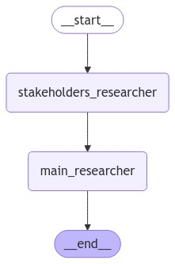
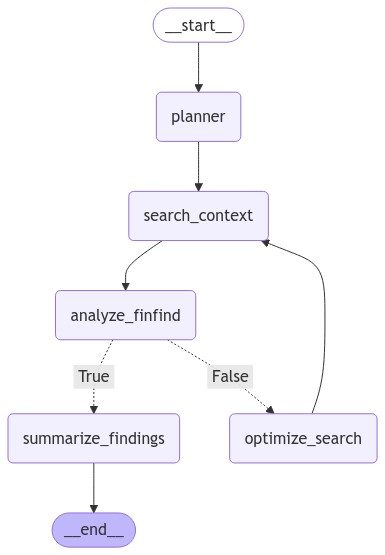

# Website Audit Reporter

The Website Audit Reporter leverages advanced Generative AI (GenAI) to perform in-depth analysis of websites. It generates comprehensive audit reports that cover various aspects such as how different stakeholders perceive the organization and whether the mission and goals are effectively communicated. This tool is designed to help non-profit organizations and stakeholders see and understand the performance and user experience of their websites, enabling them to identify and address issues to improve their website's effectiveness.

## Installation

```bash
# Clone the repository
git clone https://github.com/OrelKarmi/website-audit-reporter.git

# Navigate into the project directory
cd website-audit-reporter

# Create a virtual environment
python -m venv venv

# Activate the virtual environment
# On Windows
venv\Scripts\activate
# On Unix or MacOS
source venv/bin/activate

# Install the required dependencies
pip install -r requirements.txt

# Create a .env file from the example file
cp .example.env .env

# Set the URL in the main file and run the analysis
if __name__ == "__main__":
    url = "your url here"
    analyze_organization(url)
```

## Graphs

## Graphs

### Main Graph

The main graph divides the overall task into two parts:
1. Identification of target audiences
2. Investigation of the organization



### Researcher Graph

The Researcher Graph takes the task assigned by the Main Graph, breaks it down into smaller tasks, and generates a detailed report accordingly, as requested by the Main Graph.




